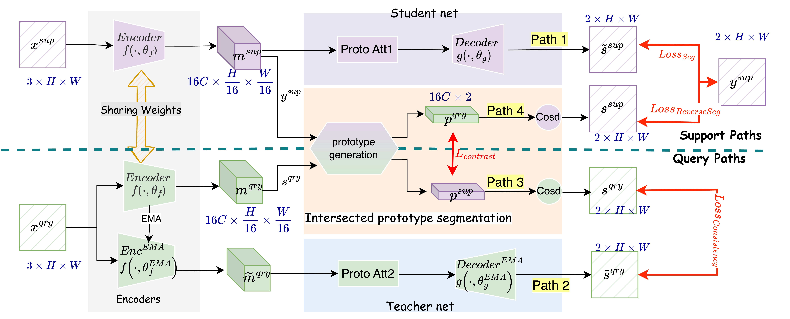

# semi-proto-seg
Prostate lesion segmentation from multiparametric MR images is challenging, possibly due to
the limited availability of labelled data associated with high labelling costs and large variability.
To address these problems, we proposed a novel semi-supervised learning algorithm that utilizes
unlabelled images to improve the performance of lesion segmentation, either from the same institution
or a different institution. The proposed algorithm employs an episodic learning method that uses
“lesion representative prototypes” generated from labelled support images and unlabelled query
images. Adapting prototype learning to semi-supervised segmentation is neither simple nor obvious.
In this work, we propose to use a teacher network to generate pseudo-labels for unlabelled images.
Then, both labelled and pseudo-labelled images serve as support and query, respectively, to train the
prototypical segmentation in a bidirectional way.

Figure1. The workflow of the proposed network that consists of four paths, labelled Paths 1-4. Paths 1 and 4 process support (labelled) images and Paths 2 and 3 process query (unlabelled) images.
## dependencies
  -  Python 3.6 +
  - PyTorch 1.0.1
  - torchvision 0.2.1
  - NumPy, SciPy, PIL
  - pycocotools
  - sacred 0.7.5
  - tqdm 4.32.2

## code
Drawing inspiration from the PANet repository, the code has undergone extensive modifications tailored specifically to the nuanced demands of semi-supervised segmentation within medical imaging.
## usage
```
python train.py
```
change configuration in "config.py" 
## data
I have uploaded the processed publicly available dataset "prostateX" into Drive. If you need to run the demo, please download the dataset to your [DataFolder].
To download the dataset:https://portland-my.sharepoint.com/:u:/g/personal/wenyan6-c_my_cityu_edu_hk/Ebwb8KxOpIlCj0p2tIlyF4QB68j65H0OcrHt9pWvrRvirg?e=0FfJF9
